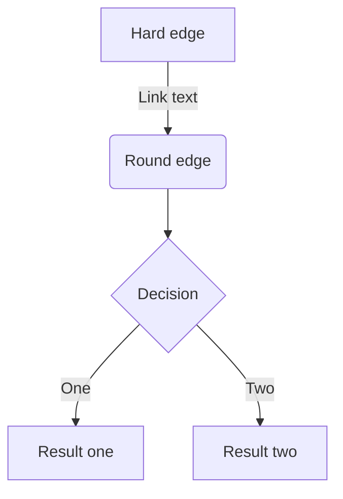

# Zenn マークダウン記法ガイド

このファイルはZennで記事を執筆する際に従うべき記法をまとめたものです。
GitHub CopilotやCursorで記事執筆時に参考にしてください。

**参考**: https://zenn.dev/zenn/articles/markdown-guide

---

## 基本的な記法

### 見出し

**推奨**: アクセシビリティの観点から見出し2（`##`）から始めることをおすすめします

```markdown
# 見出し1
## 見出し2
### 見出し3
#### 見出し4
```

### リスト

- 箇条書き: `*` または `-` を使用
- 番号付き: 数字と `.` を使用
- ネストは スペース（2-4文字）でインデント

```markdown
- リスト1
- リスト2
  - ネストリスト
  * 別の記号もOK

1. 番号付きリスト1
2. 番号付きリスト2
```

### テキストリンク

```markdown
[アンカーテキスト](リンクのURL)
```

**Markdownエディタのショートカット**: テキスト範囲選択 → URLペースト = リンク化

### 画像

#### 基本形（Altテキスト必須！）

```markdown

```

#### 横幅を指定（px単位）

```markdown

```

#### キャプション付き

画像の直下に`*`で囲んだテキストを配置

```markdown

*キャプション*
```

#### 画像にリンクを貼る

```markdown
[](リンクのURL)
```

### テーブル

```markdown
| Head | Head | Head |
| ---- | ---- | ---- |
| Text | Text | Text |
| Text | Text | Text |
```

**注意**: 表内での改行は`<br>`タグを使用

### コードブロック

#### 基本形（言語指定推奨）

````markdown
```javascript
const great = () => {
  console.log("Awesome");
};
```
````

**対応言語**: Prism.js対応言語 ([対応言語一覧](https://prismjs.com/#supported-languages))

#### ファイル名を表示

```markdown
```js:ファイル名
const great = () => {
  console.log("Awesome");
};
```
```

#### diff のシンタックスハイライト

```markdown
```diff js
@@ -4,6 +4,5 @@
+    const foo = bar.baz([1, 2, 3]) + 1;
-    let foo = bar.baz([1, 2, 3]);
```
```

同時にファイル名指定も可能：`diff js:ファイル名`

**注意**: diffは先頭に`+`, `-`, `>`, `<`, 半角スペースのいずれかが必要

#### プレーンテキスト（ハイライトなし）

```markdown
```:text
内容
```
```

### 数式

#### ブロック形式（前後に空行が必須）

```markdown
$$
e^{i\theta} = \cos\theta + i\sin\theta
$$
```

#### インライン形式

```markdown
$a\ne0$ のように記述します
```

**対応**: KaTeX ([対応記法一覧](https://katex.org/docs/support_table.html))

### 引用

```markdown
> 引用文
> 引用文
```

### 脚注

```markdown
脚注の例[^1]です。インライン^[脚注の内容その2]で書くこともできます。

[^1]: 脚注の内容その1
```

脚注は自動的にページ下部に表示されます

### 区切り線

```markdown
-----
```

### インラインスタイル

```markdown
*イタリック*
**太字**
~~打ち消し線~~
インラインで`code`を挿入する
```

### HTMLコメント（非表示）

```markdown
<!-- TODO: ◯◯について追記する -->
```

**注意**: 複数行のコメントには対応していません。改行すると無効になります

---

## Zenn独自の記法

### メッセージ（情報提供）

```markdown
:::message
メッセージをここに
:::
```

### メッセージ（警告・注意）

```markdown
:::message alert
警告メッセージをここに
:::
```

### アコーディオン（トグル）

```markdown
:::details タイトル
表示したい内容
:::
```

#### ネストさせる場合

外側の要素の開始/終了に`:` を追加：

```markdown
::::details 外側のタイトル
:::message
ネストされた要素
:::
::::
```

---

## コンテンツの埋め込み

### リンクカード（最も推奨！）

URLだけの行があるとカード表示されます。前後に空行が必要：

```markdown
https://zenn.dev/zenn/articles/markdown-guide
```

別の記法もサポート：

```markdown
@[card](URL)
```

**トラブル**: アンダースコア`_`を含むURLが認識されない場合あり

### X（Twitter）のポスト

```markdown
https://twitter.com/jack/status/20

# または x.com ドメイン
https://x.com/jack/status/20
```

#### リプライ元を非表示

```markdown
https://twitter.com/jack/status/20?conversation=none
```

### YouTube

```markdown
https://www.youtube.com/watch?v=WRVsOCh907o
```

### GitHub ファイル

ファイルURLまたはパーマリンク（前後に空行が必要）：

```markdown
https://github.com/octocat/Hello-World/blob/master/README
```

#### 行を指定

```markdown
# 開始行と終了行を指定
https://github.com/octocat/Spoon-Knife/blob/main/README.md#L1-L3

# 開始行のみ指定
https://github.com/octocat/Spoon-Knife/blob/main/README.md#L3
```

**対応**: テキストファイルのみ（画像などは埋め込み不可）

### GitHub Gist

```markdown
@[gist](GistのページURL)

# 特定ファイルのみ
@[gist](https://gist.github.com/foo/bar?file=example.json)
```

### CodePen

```markdown
@[codepen](ページのURL)

# デフォルト表示タブの変更
@[codepen](URL?default-tab=html,css)
```

### SlideShare

```markdown
@[slideshare](埋め込みコードのkey)
```

埋め込みiframeの`...embed_code/key/○○...`の`○○`部分を指定

### SpeakerDeck

```markdown
@[speakerdeck](スライドのID)
@[speakerdeck](4f926da9cb4cd0001f00a1ff?slide=24)
```

`data-id`の値を指定。スライド番号も指定可能

### Docswell

```markdown
@[docswell](スライドのURL)
@[docswell](https://www.docswell.com/s/ku-suke/LK7J5V-hello-docswell)
@[docswell](https://www.docswell.com/s/ku-suke/LK7J5V-hello-docswell#p13)
```

スライドURLまたは埋め込み用URL、スライド番号も指定可能

### JSFiddle

```markdown
@[jsfiddle](ページのURL)

# 埋め込みオプション指定
@[jsfiddle](ページのURL/embedded/{Tabs}/{Visual}/)
```

### CodeSandbox

```markdown
@[codesandbox](embed用のURL)
```

各ページの埋め込み`<iframe>`に含まれる`src`のURLを指定

### StackBlitz

```markdown
@[stackblitz](embed用のURL)
```

各ページから「Embed URL」を取得して指定

### Figma

```markdown
@[figma](ファイルまたはプロトタイプのURL)
```

共有リンクのURLを指定

### blueprintUE

```markdown
@[blueprintue](ページのURL)
@[blueprintue](https://blueprintue.com/render/0ovgynk-/)
```

---

## ダイアグラム

### mermaid.js の図表表示

コードブロックの言語名を`mermaid`にするとレンダリング：

````markdown

````

対応図表：フローチャート、シーケンス図、クラス図など

[mermaid.js 公式ドキュメント](https://mermaid-js.github.io/mermaid/#/)

### 制限事項

- **クリックイベント**: セキュリティ上、無効化
- **文字数制限**: ブロックあたり2000文字以内
- **Chain数制限**: フローチャートの`&`は10個以下

超過時はダイアグラムの代わりにエラーメッセージが表示されます

---

## 実装上の注意点

### 画像について

✅ **必ずAltテキストを付ける**（アクセシビリティ）  
✅ 必要に応じてキャプションを`*`で囲む  
✅ 大きすぎる場合は`=○○x`で幅を指定

❌ Altテキストなし  
❌ キャプション抜かし

### コードブロックについて

✅ **言語を指定する**（シンタックスハイライト有効化）  
✅ **ファイル名を付ける**（可読性向上）  
✅ コードブロック前後に空行を入れる

❌ 言語指定なし  
❌ ハイライトなし

### URL埋め込みについて

✅ **URLだけの行でリンクカード化** ← 推奨  
✅ 前後に空行が必要  
✅ リッチなOGP情報が自動取得される

❌ `[テキスト](URL)` Markdownリンク形式  
❌ 空行なし

**重要**: Zennではリンクカード化でOGP情報（タイトル、説明、アイキャッチ）を自動取得・表示するため、URLのみの行での埋め込みが推奨

### メッセージについて

✅ 重要な警告 → `:::message alert`  
✅ 参考情報 → `:::message`  
✅ 補足情報 → `:::details`（アコーディオン）

### 数式について

✅ `$$`の前後は空行が必須  
✅ KaTeX記法に従う

❌ `$$`を空行なしで配置

---

## チェックリスト

記事執筆完了時に確認：

- [ ] 見出しが`##`（h2）から始まっている
- [ ] すべての画像にAltテキストがある
- [ ] コードブロックに言語が指定されている
- [ ] コードブロック前後に空行がある
- [ ] 重要な情報が`:::message alert`で囲まれている
- [ ] 警告・注意事項が目立つように装飾されている
- [ ] URLはMarkdownリンク形式ではなく、URLのみの行で埋め込まれている
- [ ] 日本語表記が統一されている（textlintで確認）
- [ ] markdownlintエラーがない（`pnpm run lint`で確認）
- [ ] プレビューで見栄えを確認した（`npx zenn preview`）

---

## よくある間違いと対策

### URL埋め込み

❌ **間違い**: `[テキスト](https://example.com)` Markdownリンク形式  
❌ **結果**: 通常のテキストリンク表示。OGP情報が表示されない

✅ **正解**: URLだけの行（前後に空行）  
✅ **結果**: リンクカード化。タイトル、説明、アイキャッチが自動表示

```markdown
関連記事：
https://zenn.dev/yokan/articles/xxx
```

### 画像のAltテキスト

❌ `` - Altテキストなし  
✅ `` - Altテキストあり

Altテキストはスクリーンリーダーで読み上げられるため必須

### コードブロック

❌ 言語指定なし → ハイライトなし、見づらい  
✅ 言語指定あり → シンタックスハイライト、読みやすい

```markdown
❌ ``` ... ```
✅ ```javascript ... ```
✅ ```js:filename.js ... ```
```

---

## 知っておくと便利な機能

### 入力補完

エディタで `:`に続けて任意の1文字を入力すると、絵文字候補が表示されます

### HTMLタグ

現在対応しているHTMLタグ：
- `<br>` - 改行（表内改行など）
- その他のHTMLタグ（`<sup>`, `<sub>`など）は非対応

数式で上付き・下付きが必要な場合は `$a^2$`, `$a_1$` を使用

### 複数行コメント

複数行をコメントアウトしたい場合：

```markdown
<!-- 単一行コメント -->

複数行は改行を避ける:
<!-- これは <!-- 改行があると無効 --> 無効 -->
```

---

## 参考リンク

- [Zenn マークダウン記法一覧](https://zenn.dev/zenn/articles/markdown-guide)
- [KaTeX 対応記法](https://katex.org/docs/support_table.html)
- [Prism.js 対応言語](https://prismjs.com/#supported-languages)
- [mermaid.js ドキュメント](https://mermaid-js.github.io/mermaid/#/)
