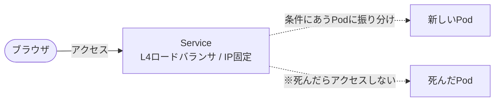

## 概要
「Kubernetes（k8s）って難しそう……」
分厚い入門書や解説を読み始めては挫折していませんか？

k8sの仕組みを最初から座学で完璧に理解することはかなり難しいです。
しかし、**まずは動かしてみる**ことから始めれば、挫折せずにk8sを使っていけるようになるはずです。

この記事では、難しいアーキテクチャの解説は一切しません。サーバーもクラウドも必要ありません。
**ノートPC一つでk8sの凄さを体感してもらいます。**

### 本記事のターゲットとゴール
- **対象読者:** Dockerの基本（コンテナやポートフォワード等）とネットワークの基本を理解しているが、k8sは未経験の方
- **ゴール:** DeploymentとServiceの役割を理解し、k8sの「宣言的」なアプローチを体感すること

### トラブルシューティング
これからDocker Desktopのセットアップやk8sクラスタの起動を行いますが、もしうまくいかない場合は、クラスタをリセットするか、Docker Desktopを再起動してみてください。

## Step 1: 環境構築
本記事では、MacでもWindowsでも同じ手順で導入できる `Docker Desktop` がインストールされていることを前提に進めます。
> Windowsの場合は、WSL2のセットアップが完了し、Docker Desktopのバックエンドとして有効になっている必要があります。
> Macでは`OrbStack`や`Colima`などのツールのほうが動作が高速なため、そちらをお使いいただいても構いません。k8sの振る舞いは同じであるため、Docker Desktopでなくても問題なく進められます。

### なぜkind（Kubernetes IN Docker）を使うのか？
k8sをローカルで動かすツールはいくつかありますが、今回はDockerコンテナの中にk8sクラスタを作る `kind (Kubernetes IN Docker)` を採用します。ホストPCの環境を汚さず、不要になったらコンテナごと簡単に捨てられるため、初心者の学習体験に最も適しているからです。


### Docker Desktopでk8sクラスタを起動
Docker Desktopを起動してサイドバーのKubernetesを選択し、`Create cluster`をクリックします。


今回は環境に依存しないよう`kind`を選択して、詳細設定はデフォルトのままインストールします。


インストールが完了すると以下の画面のようになります。


:::message
**宣言的 vs 命令的**
Docker Desktopの画面には `kubectl create deployment` などのコマンド例が記載されています。このように「〇〇を作れ（どうやるか）」と直接指示を出すのが**命令的**な操作です。
確かにこのコマンド（命令的な操作）でNginxをデプロイできますが、実運用では推奨しません。以下のような差があるからです。
- **命令的（手順を書く）**: 手順が壊れたり途中でエラーが起きると、正しく再現できなくなってしまいます。
- **宣言的（状態を書く）**: 理想の状態を提示しておけば、もし実際の状態が壊れても、k8sが勝手に正しい状態に戻してくれます。
:::

### 動作確認 - ノード一覧を表示
まずはターミナルでコマンドを実行し、いま動いているサーバー（ノード）を確認しましょう。
```bash
kubectl get nodes
```
実行結果の例：
```
NAME                 STATUS   ROLES           AGE   VERSION
kind-control-plane   Ready    control-plane   2m    v1.31.1
```
ここで`STATUS`が`Ready`になっていれば準備完了です。


## Step 2: Nginxをデプロイする (Deploymentについて)
まずはコンテナを立ち上げてみましょう。

### なぜ「Deployment」を作るのか？
k8sでは、コンテナを直接起動するわけではありません。 **Pod**（コンテナを包む最小単位のカプセル）を作り、さらにそのPodを管理する **Deployment**（管理人）を作成します。
「Nginxを1つ動かして」とDeploymentに依頼することで、もしPodが死んでもDeploymentが勝手に補充してくれます。

### Deploymentの作成
好きな場所に `deployment.yaml` を作成して以下の内容を貼り付けてください。
```yaml:deployment.yaml
apiVersion: apps/v1
kind: Deployment
metadata:
  name: nginx-deployment
spec:
  replicas: 1
  selector:
    matchLabels:
      app: nginx
  template:
    metadata:
      labels:
        app: nginx
    spec:
      containers:
      - name: nginx
        image: nginx:latest
        ports:
        - containerPort: 80
```

### `deployment.yaml`の解説
先ほど作成した`deployment.yaml`について特に重要な3点だけ解説します。

- **`kind: Deployment`**  
  `kind: ○○`で作成するリソースの種類を指定します。k8sでは、コンテナを直接単体で起動するのではなく、「Deployment」というコンテナの管理人を作ります。
- **`spec.replicas: 1`**  
  レプリカの数、つまりコンテナの数を指定します。今回は1つですが、2にすればコンテナが2つ起動します。
- **`spec.template.metadata.labels`**  
  これからネットワークを繋ぐための**目印**として使います（後のServiceの章で紐付けます）。

:::message
**YAMLのドット記法について**
この記事やk8sの公式ドキュメントでは、YAMLの階層構造を省略して `spec.replicas`（`spec`の中の`replicas`）や `spec.template.metadata.labels` などのようにドット（`.`）で繋いで表現することがよくあります。
:::

作成できたら、以下のコマンドでk8sに設計書を適用します。
```bash
kubectl apply -f deployment.yaml
```

適用後、コンテナ（Pod）が立ち上がったかを観察します。
```bash
kubectl get pods

# 実行結果例：
# NAME                                READY   STATUS    RESTARTS   AGE
# nginx-deployment-xxxxxxxx   1/1     Running   0          1m
```
`STATUS`が`Running`になっていれば成功です。


## Step 3: 自己修復の観察
k8sの真骨頂である「自己修復能力」を観察しましょう。手作業で復旧しなくてよくなる体験です。

### あえてPodを破壊してみる
NAME列にある実際のPod名をコピーして、削除コマンドを実行します。
（※ `nginx-deployment-xxxxxxxx` ではなく、各自の環境に表示された実際の名前を使います）

```bash
kubectl delete pod [Pod名]
```

もう一度`get pods`を実行すると、新しいpodが起動しているはずです。
```bash
kubectl get pods
```

:::message
**観察ポイント: 新しいPodが自動で復活する**
先ほど消したPodとは別のPodがすでに自動で立ち上がっているはずです。

k8sは「提出された設計図（理想状態: `replicas: 1`）」と「実際のサーバー（現実状態: `replicas: 0`）」を常に見比べ、ズレを検知すると自動で足りない分を補充します。
この自己修復機能のおかげで、コンテナが落ちるたびに手作業で再起動する必要がなくなります。
:::


## Step 4: ブラウザからアクセスする (Serviceについて)
無事にDeploymentがNginxのPodを管理してくれていますが、この状態ではまだ外部からブラウザでアクセスできません。

### なぜ Service に任せるのか？
Dockerを使っていた時は `-p 8080:80` とポートフォワードをして直結していました。しかしk8sでは、Podに直接繋ぐのは御法度です。
先ほど観察したように、**Podは死んだら別の名前・別のIPアドレスで生まれ変わる（使い捨ての）存在**だからです。IPが固定ではないため、毎回接続先を変えなければなりません。

そこで、アクセスを安定して受け止める **L4（TCP/UDP）ロードバランサ** としての役割を持つ 「`Service`」 というリソースを作ります。



### Serviceの作成
`service.yaml` を作成します。
```yaml:service.yaml
apiVersion: v1
kind: Service
metadata:
  name: nginx-service
spec:
  selector:
    app: nginx
  ports:
    - protocol: TCP
      port: 80
      targetPort: 80
```
作成したら提出します。
```bash
kubectl apply -f service.yaml
```

:::message
**観察ポイント: どうやってServiceは裏のPodを見つけるのか？**
Serviceの `spec.selector.app: nginx` と、Deploymentで作ったPodの `spec.template.metadata.labels.app: nginx`。
この**同じラベル（名札）を持っていること**が両者を紐付ける条件です。もし裏のPodが死んで生まれ変わっても、新しいPodが同じラベルさえ付けていれば、Serviceは迷わず新しい方へ自動で通信を振り分けてくれます。
:::


### 動作確認 (port-forward)
今回はDocker Desktopの内側にk8sが閉じ込められているため、PCのブラウザからServiceへ到達するために `kubectl port-forward` を使ってトンネル（裏道）を作ります。

> ※ 本番運用ではport-forwardは使わず、Cloudのロードバランサや `Ingress` と呼ばれる仕組みを使って、きれいに外部公開の設定を行います。今回は体験用のショートカットです。

```bash
kubectl port-forward service/nginx-service 8080:80
```
ブラウザで `http://localhost:8080` にアクセスし、Nginxの画面が表示されれば成功です！


## Step 5: 後片付け
1. `port-forward` はターミナルで `Ctrl+C` を押して終了します。
2. 作成したリソースを削除するには `kubectl delete` を使います。
```bash
kubectl delete -f service.yaml
kubectl delete -f deployment.yaml
```
3. k8sクラスタ自体の削除
Docker Desktopのサイドバーにある「Kubernetes」メニューをクリックし、作成したクラスタの右側にあるゴミ箱アイコン（Delete）や「Stop」アクションを選択することで完全に削除できます。


## まとめと次のステップ

最後までお疲れ様でした。
ここまでの観察を通じて、「ただのコンテナ起動ツール」ではないk8sとはどんなものかが少し見えてきたのではないでしょうか。

### なぜ、世のエンジニアはk8sを使うのか？
これまでDockerや旧来のインフラで抱えていた課題と、今回体験したk8sの解決策を比較してみましょう。

| 旧来の手動運用 / 課題 | k8sによる解決策（今回体験したこと） |
|---|---|
| 障害が起きると手動でコンテナを再起動していた | **理想と現実の自動収束**によって勝手に新しいPodが起動した |
| コンテナの増減に合わせてルーターの設定も変えていた | **Serviceとラベルの紐付け**によって、通信先が動的に振り分けられた |
| 本番とローカルで作業手順や環境のズレ（属人化）が生じた | **すべての構成をYAML（状態の宣言）**で記述するため、どこでも同じ状態が再現できた |

k8sは「どうやって動かすか」を人間が頑張るツールではなく、「こういう状態であってほしい」という目標(YAML)を渡すと、あとはシステム側が一生懸命その状態を保ち続けてくれるツールです。これが最大の強みです。

### 次のステップへの学習導線
ここから先は、以下のキーワードを調べていくとより実践的なk8sの理解が深まるはずです。
- **LB / Ingress:** port-forwardに頼らず、本番環境で外からトラフィックを受け取る仕組み
- **Helm:** 長くて複雑なYAMLファイルをテンプレート化して楽に管理するパッケージマネージャー
- **GitOps (ArgoCD / Flux):** `kubectl apply` さえも手動で打たず、GitHubのYAMLが更新されたら自動でk8sに反映させるモダンな運用手法